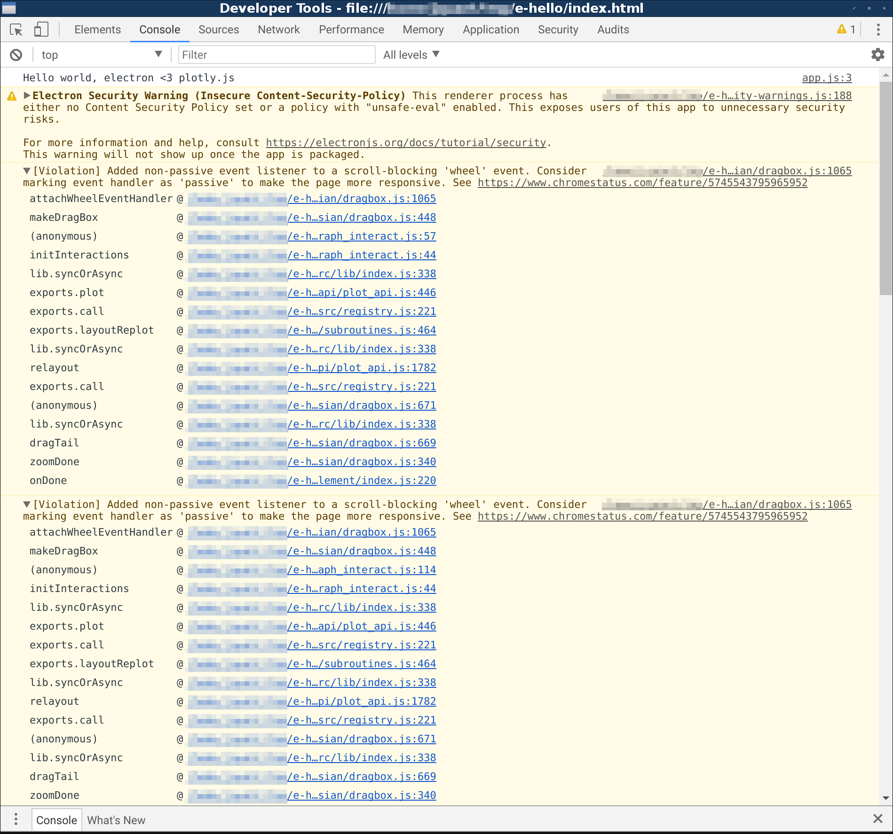

* `npm install` # installs dependencies
* `node_modules/.bin/electron .` # runs app
* Set log level to "Verbose" in DevTools console
* Double-click on plot
* Observe warnings:
  - If using electron 1.8.3 / Chrome 59: `[Violation] Added non-passive event listener to a scroll-blocking 'wheel' event. Consider marking event handler as 'passive' to make the page more responsive.` (7 times, `coming from node_modules/plotly.js/src/plots/cartesian/dragbox.js:1065`)
  - If using electron 2.0.0-beta.3 / Chrome 61: `[Violation] Added non-passive event listener to a scroll-blocking 'wheel' event. Consider marking event handler as 'passive' to make the page more responsive.` (variations repeated, coming from `node_modules/plotly.js/src/plots/cartesian/dragbox.js:1065`)

